# Zona12

> E-commerce full-stack de equipaciones de fútbol construido con criterios de producción: storefront responsive, API separada, PostgreSQL transaccional, gestión operativa, seguridad de sesiones, SEO, mensajería, monitorización de errores, CI y modo demo aislado.

**Demo pública:** [zona12.dpdns.org](https://zona12.dpdns.org/)
> Debido a que está alojado en un servidor gratuito, quizás haya que esperar 15-30s en que se carguen las imagenes la primera vez que se entra.
---

## Índice

- [Overview](#overview)
- [Objetivo](#objetivo)
- [Para quién está pensado](#para-quién-está-pensado)
- [Características principales](#características-principales)
- [Arquitectura](#arquitectura)
- [Tecnologías utilizadas](#tecnologías-utilizadas)
- [Integraciones](#integraciones)
- [Funcionalidades detalladas](#funcionalidades-detalladas)
- [Modelo de datos](#modelo-de-datos)
- [Seguridad](#seguridad)
- [Diseño y UX/UI](#diseño-y-uxui)
- [SEO y rendimiento](#seo-y-rendimiento)
- [Testing y calidad](#testing-y-calidad)
- [CI y demo pública](#ci-y-demo-pública)
- [Despliegue e infraestructura](#despliegue-e-infraestructura)
- [Herramientas de desarrollo asistido por IA](#herramientas-de-desarrollo-asistido-por-ia)
- [Decisiones técnicas](#decisiones-técnicas)
- [Retos técnicos](#retos-técnicos)
- [Aprendizajes técnicos que demuestra el proyecto](#aprendizajes-técnicos-que-demuestra-el-proyecto)
- [Mi trabajo / contribución](#mi-trabajo--contribución)
- [Estado actual](#estado-actual)
- [Futuras mejoras](#futuras-mejoras)
- [Limitaciones conocidas](#limitaciones-conocidas)

---

## Overview

Zona12 es una plataforma de comercio electrónico de camisetas de fútbol, selecciones, retros, chándals, cortavientos y Fórmula 1. Cubre el ciclo completo de compra: catálogo filtrable, búsqueda, ficha de producto con variantes por talla, personalización (dorsal, nombre, parches), carrito, checkout con o sin cuenta, recogida en persona, seguimiento de pedido, favoritos y solicitudes de prendas bajo encargo cuando no hay stock.

No es una tienda de presentación: el mismo sistema incluye un panel administrativo completo (productos, tallas, stock, pedidos, clientes, recogidas, encargos, proveedor y métricas), y ninguna regla de negocio crítica vive en el cliente — el servidor recalcula precio, disponibilidad, stock y permisos en cada operación.

## Objetivo

Zona12 nació como un proyecto personal para aprender desarrollo full-stack con las restricciones de un sistema real —stock, pagos, sesiones, operación diaria— en vez de un ejercicio de tutorial, la finalidad era crear una página web con el rigor de una tienda online profesional. Esa progresión explica buena parte de las decisiones técnicas del proyecto: no se diseñó como demo académica, sino asumiendo desde el principio que el stock, el dinero y los datos de cliente tenían que comportarse como en producción.

## Para quién está pensado

Aficionados al fútbol que buscan comprar o personalizar una equipación de su equipo, selección o edición retro favorita, con opción de recogida presencial además de envío — inferido de las categorías reales del catálogo (equipos de club, selecciones nacionales, ediciones retro, Fórmula 1, personalización con dorsal/nombre/parches).

## Características principales

| Área | Alcance implementado |
| --- | --- |
| Storefront | Inicio, siete secciones de catálogo, filtros, búsqueda, paginación, ficha de producto, carrito, checkout, perfil, soporte y páginas legales |
| Comercio | Versiones fan/player/player manga larga, stock independiente por talla, personalización con dorsal/nombre/parches, compra como invitado, cuatro métodos de pago/entrega y recogida en tienda |
| Back office | Productos, galerías de imagen, stock, pedidos, usuarios, encargos, proveedor, configuración y reporting |
| Operación | Email/SMS transaccional, error tracking en producción, logging con retención configurable, entorno de demo reproducible, suite de tests y CI en GitHub Actions |

## Arquitectura

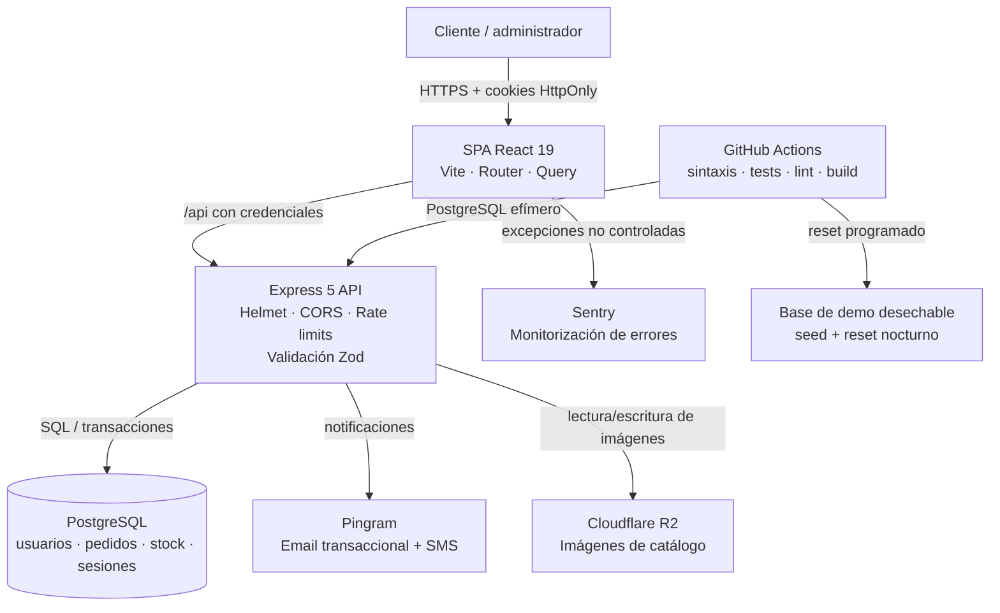

**Responsabilidades:** el navegador presenta datos, persiste el carrito versionado y cachea consultas; la API valida/sanea entradas, calcula importes y gestiona transacciones; PostgreSQL es el límite de integridad; Pingram es el único transporte de mensajes; Cloudflare R2 almacena las imágenes de catálogo fuera del disco efímero del contenedor; Sentry captura errores del cliente en producción; CI verifica backend y frontend de forma independiente.

## Tecnologías utilizadas

No es solo una lista: cada tecnología está aquí porque resuelve un problema concreto del proyecto.

| Capa | Tecnología | Por qué se usa aquí |
| --- | --- | --- |
| **Frontend** | React 19 + TypeScript | Tipado estático en un dominio con muchas variantes de producto (talla × tipo × personalización) donde un error de forma de datos es fácil y caro |
| | Vite 8 | Build rápido; además valida en build que `VITE_API_URL` exista y sea HTTPS, evitando desplegar una tienda apuntando a `localhost` |
| | TanStack Router + Query | Enrutado tipado y cacheo/revalidación de datos de catálogo sin gestionar estado de servidor a mano |
| | React Hook Form + Zod | Mismo motor de validación (Zod) en frontend y backend — los esquemas de formulario y de API no divergen |
| | Tailwind + shadcn/ui | Sistema de componentes consistente sin escribir CSS a medida para cada pantalla nueva |
| **Backend** | Node.js 22 + Express 5 | API REST simple y explícita, sin la sobrecarga de un framework full-stack cuando el frontend ya es una SPA separada |
| | Zod | Valida body/query, descarta campos no declarados y devuelve `400` estructurado — la misma disciplina de tipos que en el frontend |
| | `pg` (driver nativo, sin ORM) | Control directo de transacciones en operaciones donde la atomicidad importa (crear pedido = tocar stock + líneas + pedido en una sola transacción) |
| | bcryptjs + jsonwebtoken | Hash de contraseñas con coste 12 y JWT con `issuer` ligado a `CLIENT_URL`, para que un token de demo no sea válido contra producción |
| | Helmet, CORS exacto, express-rate-limit | Perímetro HTTP mínimo viable: cabeceras de seguridad, origen exacto con credenciales, límites por endpoint según superficie de abuso |
| **Base de datos** | PostgreSQL 16 | Transacciones ACID reales para el punto crítico del negocio: el checkout no puede sobrevender stock |
| **Mensajería** | Pingram (REST, `fetch` nativo) | Transporte único de email transaccional y SMS de verificación, sin dependencia de un SDK propietario |
| **Almacenamiento de imágenes** | Cloudflare R2 (cliente S3 vía `@aws-sdk/client-s3`) | Ver [Integraciones](#integraciones) |
| **Observabilidad** | Sentry (`@sentry/react` + plugin de Vite) | Ver [Integraciones](#integraciones) |
| **Calidad** | Node test runner, ESLint, TypeScript, GitHub Actions, pnpm lockfiles | Integración contra PostgreSQL real en CI, no mocks |
| **Tooling** | pnpm 11, Docker Compose, Nodemon | Entorno local reproducible |

## Integraciones

| Servicio | Uso | Detalle técnico verificado |
| --- | --- | --- |
| **Pingram** | Email transaccional + SMS | Timeout de 8 s; cubre verificación de email, recuperación de contraseña, confirmaciones de pedido/encargo, avisos administrativos y verificación SMS del checkout de invitado |
| **Cloudflare R2** | Almacenamiento de imágenes de catálogo, subidas desde el panel de admin | Cliente S3-compatible (`@aws-sdk/client-s3`) apuntando a `{account_id}.r2.cloudflarestorage.com`. Permite al administrador dar de alta un producto nuevo con sus imágenes directamente desde el dashboard, sin tocar código ni desplegar — y saca las imágenes del disco efímero del contenedor, el mismo problema que resolvió guardar las imágenes de encargo en PostgreSQL (ver [Decisiones técnicas](#decisiones-técnicas)) |
| **Sentry** | Monitorización de errores en producción (frontend) | SDK de React + plugin de build de Vite para subir source maps, de forma que los errores capturados en producción se puedan depurar contra el código fuente real, no contra el bundle minificado |

## Funcionalidades detalladas

### Catálogo, ficha y carrito

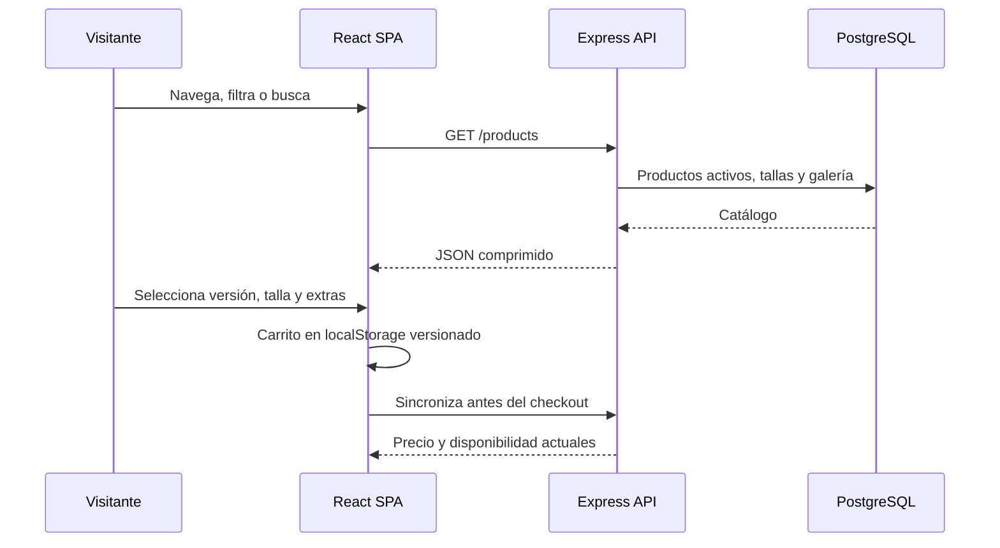

El carrito es una ayuda de interfaz, no la fuente de verdad. Antes de crear el pedido, el servidor vuelve a comprobar producto, precio, talla y stock desde la base de datos.

### Registro, login y sesión

1. El registro valida los datos, guarda el hash del código de verificación y solo crea el usuario tras confirmarlo por email.
2. El login compara siempre contra bcrypt —incluso con un email inexistente— para no filtrar por tiempo qué cuentas existen, y emite cookies de acceso/refresco.
3. El JWT se firma y valida con `issuer` derivado de `CLIENT_URL`, vinculándolo al despliegue que lo emitió.
4. Axios coordina un único refresh en curso ante un `401` y reintenta una vez.
5. Cada ruta de administración consulta el rol actual en PostgreSQL, no se fía del claim (potencialmente desactualizado) del token.

### Checkout y fulfillment

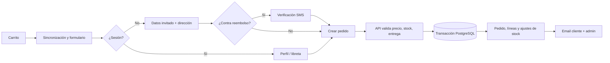

Contrarrembolso, Bizum, transferencia y recogida tienen recorridos de estado distintos entre sí.

### Recogida, encargos, favoritos y administración

- **Recogida:** disponibilidad por franjas semanales, excepciones por fecha, capacidad de cinco plazas por franja.
- **Encargos:** cuando no hay stock de una equipación, cualquier usuario (con o sin cuenta) puede pedir que se la busquen, adjuntando imagen de referencia opcional. La imagen se guarda como bytes en PostgreSQL, no en disco.
- **Favoritos:** guardado idempotente, y sirve como señal de demanda independiente de las ventas reales.
- **Administración:** métricas, ventas, proveedor, usuarios, catálogo, pedidos, encargos, configuración y recogidas bajo rutas protegidas por rol.

La referencia completa de endpoints (auth, entrada y errores por ruta) vive en [`API.md`](API.md), separada de este documento para mantener el README enfocado en explicar el proyecto en vez de listar 40+ rutas.

## Modelo de datos

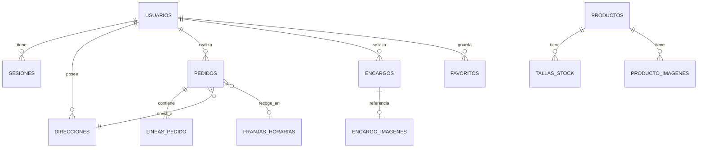

`schema.sql` incluye una guarda dentro de la propia base de datos: si la tabla `configuracion` marca el entorno como producción, los scripts destructivos (`DROP TABLE`, seed de datos de prueba) abortan en vez de ejecutarse.

El checkout calcula el precio desde la base de datos dentro de una transacción. La dirección usada en un pedido se archiva/copia en vez de editarse in situ, para que el historial de fulfillment no cambie retroactivamente si el cliente edita su libreta de direcciones después.

## Seguridad

- **Cookies HttpOnly**: los tokens de acceso y refresco no son legibles desde JavaScript; en producción usan `Secure` y `SameSite=Lax`.
- **Refresh gestionado en servidor**: token aleatorio guardado como hash, con rotación y ventana deslizante de 7 días (máximo absoluto configurable, 30 días por defecto).
- **JWT ligado al entorno**: la firma y validación exigen un `issuer` derivado de `CLIENT_URL`.
- **Rol de administrador siempre vigente**: las rutas admin consultan PostgreSQL en cada request, no confían en el claim del token.
- **Validación defensiva con Zod**: descarta campos no declarados; los IDs no aceptan valores parciales como `12abc`.
- **Mitigación de timing attacks**: bcrypt con coste 12, hash señuelo en login para que un email inexistente tarde lo mismo que uno real.
- **Perímetro HTTP**: Helmet, CORS de origen exacto con credenciales, `trust proxy` en producción, compresión de respuestas.
- **Rate limiting por superficie de riesgo, no genérico**: límites distintos para login (fuerza bruta), registro (creación masiva de cuentas) y recuperación (cada intento manda un email real) — ver el caso narrado en [Decisiones técnicas](#decisiones-técnicas).
- **Auditoría estática con [react-doctor](https://github.com/millionco/react-doctor)**: escaneo determinista del código React (`npx react-doctor@latest`) que revisa patrones de estado/efectos, rendimiento, arquitectura, accesibilidad y seguridad, usado para detectar antipatrones antes de que lleguen a producción.

## Diseño y UX/UI

El proyecto tiene filtros dedicados para móvil, sidebar en desktop, layout y navegación responsive, checkout y perfil adaptados, y zoom de producto en la ficha. Capturas tomadas contra la demo pública.

<table width="100%">
<tr>
<td align="center"><b>Inicio — escritorio</b> </td>
</tr>
<tr>
<td align="center"><b>Inicio — móvil</b> </td>
</tr>
<tr>
<td align="center"><b>Catálogo — escritorio</b> 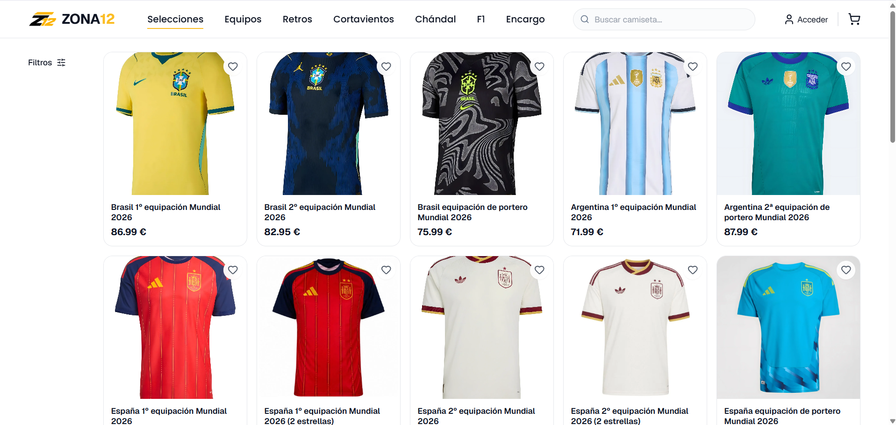</td>
</tr>
<tr>
<td align="center"><b>Secciones — móvil</b> 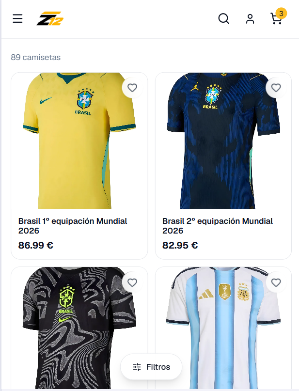</td>
</tr>
<tr>
<td align="center"><b>Filtros — escritorio</b> 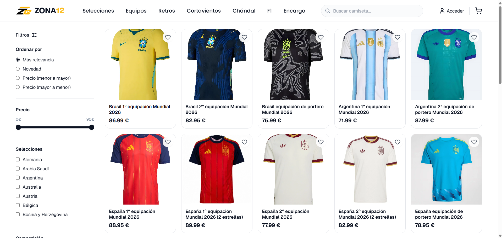</td>
</tr>
<tr>
<td align="center"><b>Filtros — móvil</b> 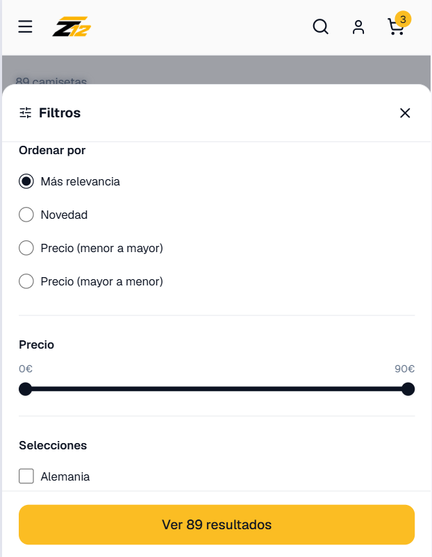</td>
</tr>
<tr>
<td align="center"><b>Desplegable — móvil</b> 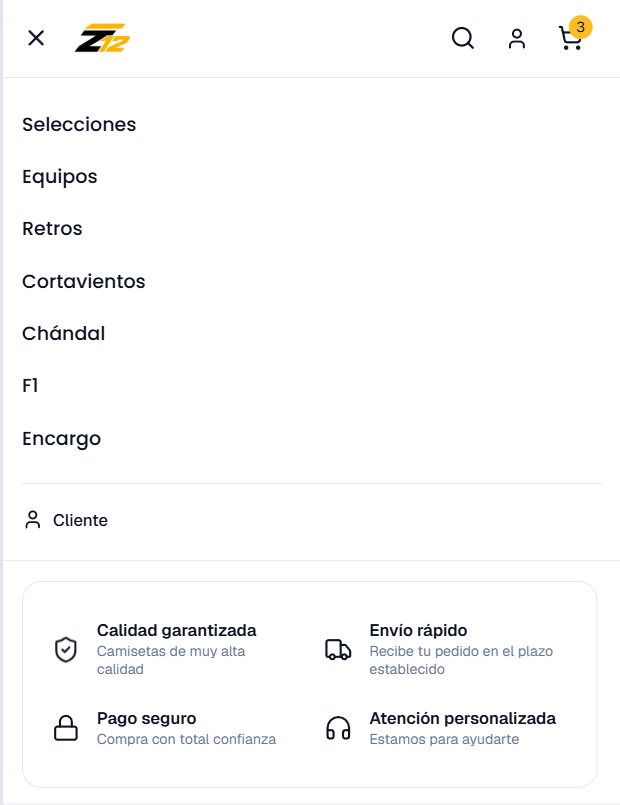</td>
</tr>
<tr>
<td align="center"><b>Buscador — móvil</b> 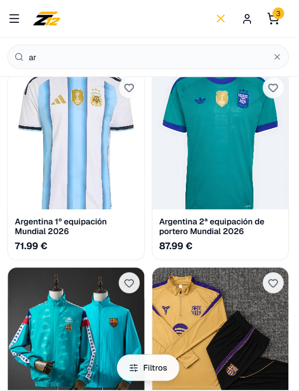</td>
</tr>
<tr>
<td align="center"><b>Ficha de producto — escritorio</b> 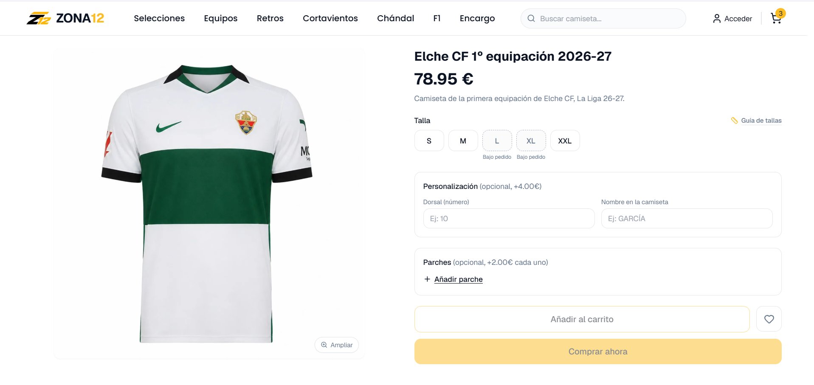</td>
</tr>
<tr>
<td align="center"><b>Carrito — escritorio</b> 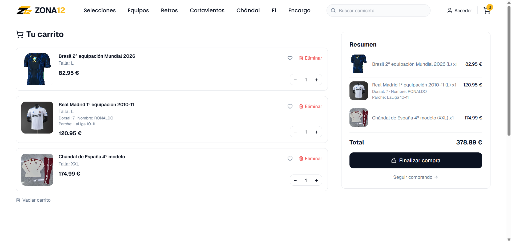</td>
</tr>
<tr>
<td align="center"><b>Carrito — móvil</b> 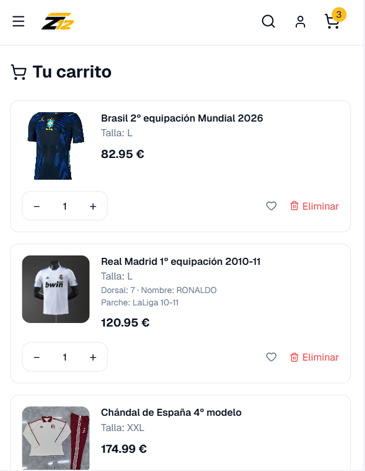</td>
</tr>
<tr>
<td align="center"><b>Pedido — escritorio</b> 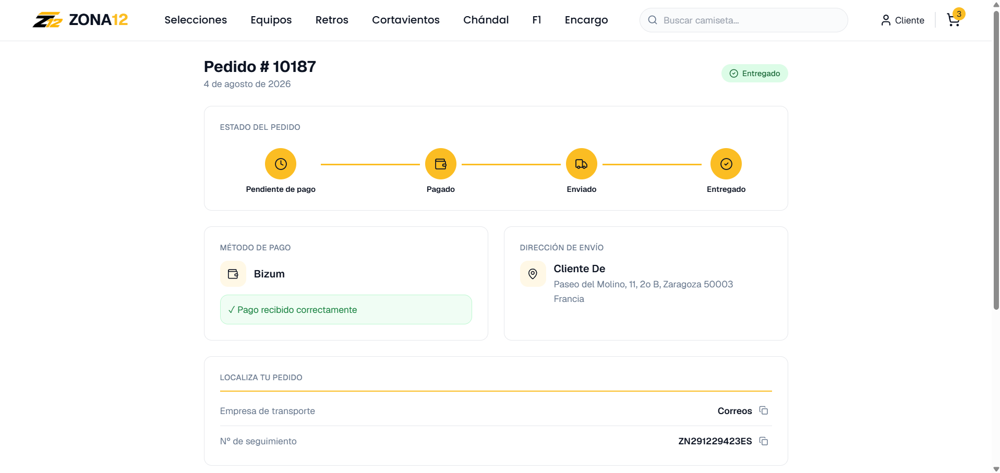</td>
</tr>
<tr>
<td align="center"><b>Pedido — móvil</b> 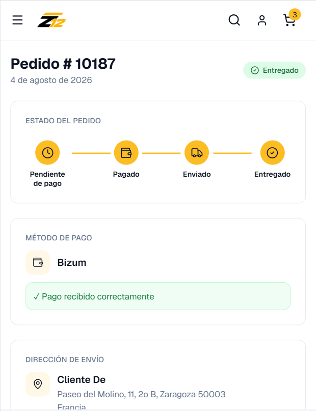</td>
</tr>
<tr>
<td align="center"><b>Perfil — escritorio</b> 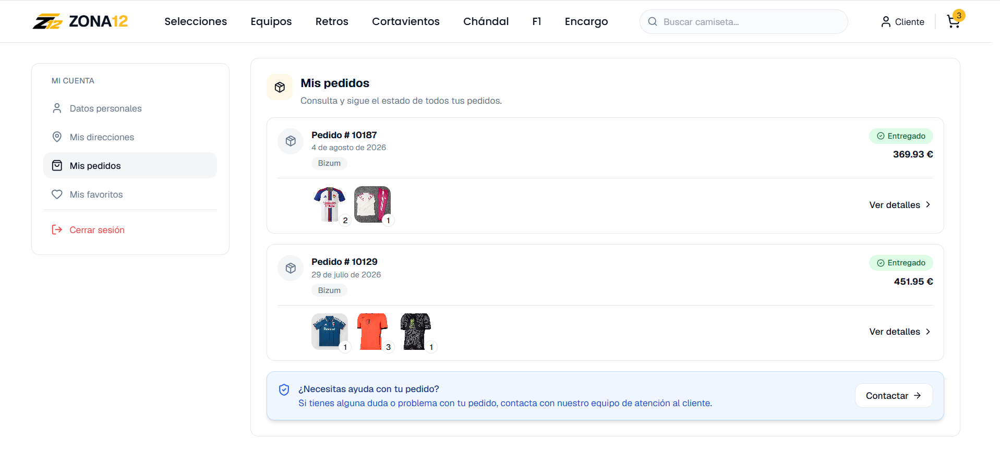</td>
</tr>
<tr>
<td align="center"><b>Perfil — móvil</b> 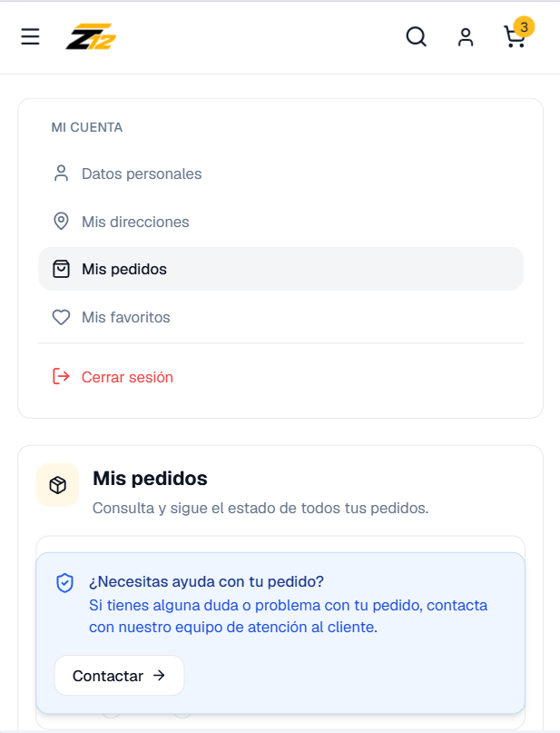</td>
</tr>
<tr>
<td align="center"><b>Panel de administración — escritorio</b> 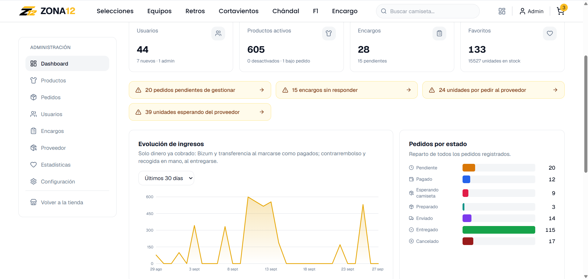</td>
</tr>
</table>

## SEO y rendimiento

La aplicación es una SPA React/Vite sin SSR ni prerender. Lo que sí implementa:

- Hook propio `useSeo` para título, descripción, canonical, robots, Open Graph, Twitter y JSON-LD, con metadata de fallback en `index.html` para crawlers sin JavaScript.
- `robots.txt` permite los assets públicos de la SPA, bloquea admin/tokens/búsqueda interna; las rutas privadas además llevan `noindex, nofollow` desde la propia app.
- Plugin de Vite que consulta el catálogo activo y genera el sitemap en build. Auditoría medida: **619 URLs**, de las cuales **605** llevan entrada de imagen. Si la API falla durante el build, publica rutas fijas en vez de romper el build.
- JSON-LD de producto/oferta/breadcrumbs con datos reales — no inventa GTIN, reviews ni ratings.

### Compresión medida de API

| `GET /api/products` | Payload medido |
| --- | ---: |
| Sin comprimir | 580.946 B |
| gzip | 36.627 B |
| Brotli | 28.376 B |

**Límite conocido:** al no haber SSR/prerender, las previews sociales de producto (Googlebot/Bingbot ejecutan JS, pero los crawlers de redes sociales normalmente no) reciben la tarjeta genérica del HTML inicial en vez de metadata específica del producto. El bundle actual es un único fichero de 1,18 MB sin `import()` dinámico — margen de mejora identificado, no resuelto todavía.

## Testing y calidad

Backend con Node test runner. Los tests unitarios no requieren base de datos; la suite de integración corre contra un Express y un PostgreSQL reales, no contra mocks.

| Suite | Riesgo que protege |
| --- | --- |
| `checkout.test.js` | Precio calculado desde BD, límites, productos no vendibles, sesión expirada |
| `stock.test.js` | El stock no se crea, duplica ni pierde en las transiciones de pedido |
| `direcciones.test.js` | La dirección histórica de un pedido sobrevive a la edición/borrado del perfil |
| `recogida.test.js` | Las franjas y pedidos no desaparecen ni se eliminan de forma insegura |
| `autorizacion.test.js` | El rol admin se comprueba en tiempo real y los pedidos ajenos están aislados |
| `concurrencia.test.js` | Compras/franjas concurrentes no sobrevenden |
| `encargos.test.js` | Cupo de imágenes y liberación al cerrar un encargo |
| `unitarios.test.js` | Transiciones de estado, cálculo de costes e IDs estrictos |

19 tests unitarios pasan sin necesidad de infraestructura montada; la suite completa (con PostgreSQL) corre en CI.

## CI y demo pública

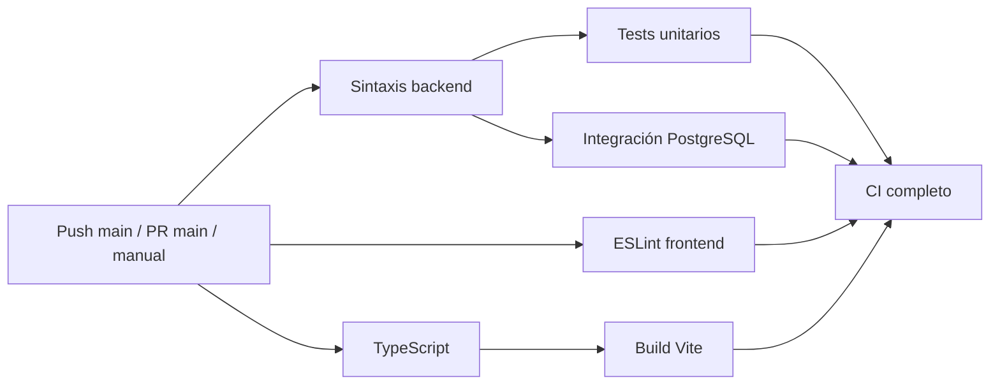

`.github/workflows/ci.yml` se dispara en push a `main`, PR contra `main` y de forma manual. Node 22, pnpm 11.24.0, `pnpm install --frozen-lockfile`. Levanta `postgres:16-alpine`, aplica el esquema, arranca Express real, verifica `/health` y ejecuta la integración completa — el job falla si algún test se salta.

La demo pública y la tienda real sirven el **mismo commit**, sin ramas ni código duplicado: `backend/src/demo/demo.js` centraliza el comportamiento y solo se activa si `DEMO_MODE === 'true'` exactamente. `demo-reset.yml` reconstruye esquema, catálogo y cuentas cada madrugada con doble guarda (nombre de base + `DEMO_MODE=true`).

## Despliegue e infraestructura

- El servidor exige `DATABASE_URL`, `JWT_SECRET` de mínimo 32 caracteres, `CLIENT_URL` en HTTPS y `NODE_ENV=production` — se niega a arrancar sin ellas.
- El build de frontend exige `VITE_API_URL` en HTTPS o falla explícitamente, para no publicar una tienda apuntando a `localhost`.
- Las imágenes de encargo se guardan en PostgreSQL en vez de disco, precisamente porque el disco de hosts como Render es efímero y se borra en cada redeploy.
- `frontend/public/_redirects` está configurado para servir `index.html` en cualquier ruta no-fichero (necesario para que el router de cliente no dé 404 al recargar).

Stack de despliegue confirmado: backend en **Render**, frontend en **Cloudflare Pages**, base de datos PostgreSQL gestionada en **Neon**.

## Herramientas de desarrollo asistido por IA

El desarrollo se apoyó en un flujo de trabajo con agentes de IA (Claude Code, con Codex vía MCP y un grafo de conocimiento propio llamado Graphify), gobernado por un documento de reglas del proyecto (`CLAUDE.md`) que define cómo deben comportarse los agentes en este repositorio concreto. Cinco puntos representativos de ese proceso:

1. **El nivel de supervisión escala con el riesgo, no es uniforme.** Un cambio de texto o estilo se implementa directo; un cambio en autenticación, checkout o esquema de base de datos exige un plan explícito y revisión independiente (Codex) antes de tocar código.
2. **Revisión independiente obligatoria en cambios críticos**, con un veredicto binario (`APPROVED` / `CHANGES NEEDED`) antes de implementar, no después.
3. **"Código existente primero"**: antes de crear un componente, hook o endpoint nuevo, la regla obliga a comprobar si ya existe algo reutilizable — política explícita contra la duplicación que suele generar el uso indiscriminado de agentes.
4. **Eficiencia como regla explícita, no como afterthought**: "optimizar para trabajo útil, no para actividad máxima del agente" — evitar llamadas a herramientas que no aporten información nueva.
5. **La validación visual del frontend es responsabilidad humana**, no del agente: las reglas prohíben explícitamente que el agente abra un navegador para "comprobar que algo se ve bien"; la carpeta `diseño/` se usa como referencia visual para que el agente implemente la interfaz con fidelidad, pero la aprobación final del resultado la hace una persona.

Ver [`CLAUDE.md`](CLAUDE.md) para el documento completo.

## Decisiones técnicas

| Problema | Decisión | Resultado |
| --- | --- | --- |
| Carrito manipulable en cliente | Recalcular precio y disponibilidad desde PostgreSQL en cada checkout | El precio final nunca depende de lo que el cliente envía |
| Métodos de pago con flujos distintos | Máquina de estados central por método de pago | Los estados, el proveedor y los ajustes de stock no se derivan de forma implícita |
| Demo pública con acceso de administrador | Mismo commit + base de datos separada + doble guarda de reset | La demo es recuperable sin mantener una rama distinta |
| Sesión entre subdominios | Cookies HttpOnly + CORS de origen exacto | Ningún token queda accesible desde JavaScript |
| Rol de admin desactualizado en el JWT | Consultar el rol en PostgreSQL en cada request admin | Revocar un rol es inmediato, no espera a que expire el token |
| Disco de contenedor efímero (Render y similares) | Guardar la imagen de encargo como bytes en PostgreSQL | La imagen sobrevive a un redeploy o reinicio |
| SEO con posibles URLs duplicadas | Helpers de slug/canonical compartidos entre la app y el generador de sitemap | El canonical y el sitemap nunca pueden divergir |

### Un caso narrado: rate limiting por superficie de riesgo

El límite de peticiones no es un middleware genérico aplicado a toda la API. Cada endpoint sensible tiene su propio límite, justificado por el coste real de abusarlo: login (fuerza bruta), registro (creación masiva de cuentas), recuperación de contraseña (cada intento dispara un email real, así que el límite es más estricto), y creación de pedidos/encargos (cada `POST` dispara dos emails — cliente y admin — lo que lo convierte en un vector para inundar buzones).

El caso más interesante es el límite de reenvío de código de verificación: al principio, cada intento fallido (incluyendo pulsar "reenviar" varias veces seguidas por impaciencia) consumía cupo del limitador de registro igual que un intento real. El resultado era que un usuario podía quedarse bloqueado a medio registro sin haber conseguido nunca completar la verificación. La solución fue distinguir, dentro del propio limitador, qué tipo de rechazo cuenta para el cupo y cuál no: un `429` de "espera antes de reenviar" no consume cupo (nadie ha recibido un email de más), pero un `409` de "este email ya existe" sí lo consume, porque es la superficie real de enumeración de cuentas que el límite existe para frenar.

## Retos técnicos

### Autocompletado del navegador filtrando datos entre campos

Poco después del primer despliegue, el campo de búsqueda de la página de perfil aparecía relleno automáticamente con el email del usuario sin que nadie lo hubiera escrito. La causa no estaba en el buscador: el formulario de cambio de contraseña, en la misma página, tenía un campo de contraseña sin `autocomplete` explícito. El gestor de contraseñas del navegador interpretaba ese campo como un login y autocompletaba tanto la contraseña guardada como, por asociación, el email en el primer input de texto que encontraba en la página —en este caso, el buscador. La solución fue forzar `autocomplete="off"` en el campo de contraseña del formulario de cambio, evitando que el navegador lo tratara como un formulario de login.

## Aprendizajes técnicos que demuestra el proyecto

Esto se basa en lo que el código evidencia de forma objetiva, no en una afirmación personal tuya (esa va en la siguiente sección):

- Diseño de un sistema de autenticación completo con cookies HttpOnly, rotación de refresh tokens y mitigación de enumeración de usuarios vía timing.
- Modelado de datos transaccional donde la integridad del stock y del precio depende de PostgreSQL, no de la confianza en el cliente.
- Rate limiting diferenciado por superficie de riesgo en vez de un límite genérico.
- Integración de servicios externos (email/SMS transaccional, almacenamiento de objetos S3-compatible, error tracking) resueltas como capas desacopladas del dominio.
- SEO técnico en una SPA sin SSR: generación de sitemap en build, JSON-LD real, gestión de canonical — con medición real de resultados (619 URLs, compresión de payload) en vez de afirmaciones sin verificar.
- Diseño de un entorno de demo pública que comparte código con producción sin duplicar lógica, con reset automatizado y doble guarda de seguridad.
- Testing de integración contra infraestructura real (PostgreSQL) en CI, no solo mocks.

## Mi trabajo / contribución

Desarrollé el 100% del código de Zona12 en solitario: frontend, backend, modelo de datos, seguridad, SEO y las integraciones con Pingram, Cloudflare R2 y Sentry.

## Estado actual

El proyecto llegó a producción (Render + Cloudflare Pages + Neon) y estuvo operativo. Actualmente está vendido a un tercero — el autor de este README ya no opera ni mantiene la web en su estado actual, por lo que el dominio de producción no se enlaza aquí: no hay forma de garantizar que su contenido de hoy siga representando el trabajo original. La presentación en portfolio usa, en su lugar, una demo propia desplegada de forma independiente en [`zona12.dpdns.org`](https://zona12.dpdns.org/).

## Futuras mejoras

- Prerender o SSR para que las previews sociales de producto muestren metadata específica en vez de la tarjeta genérica.
- Code splitting del bundle único de 1,18 MB.
- Reordenar las rutas administrativas de `orders` y `encargos` que actualmente quedan ocultas por el parser numérico de la ruta genérica `/:id`.
- Revisión manual de las 81 imágenes marcadas en el estudio de upscale (`docs-upscaling/UPSCALING.md`) antes de integrarlas como WebP de producción.
- Incorporar una pasarela de pago automatizada — actualmente no hay ninguna integrada; los métodos disponibles son contrarrembolso, Bizum, transferencia y recogida.

## Limitaciones conocidas

- No hay integración de pasarela de pago automatizada: los métodos actuales son contrarrembolso, Bizum, transferencia y recogida.
- La SPA necesita prerender/SSR para previews sociales completas por producto.
- Bundle único de 1,18 MB sin `import()` dinámico.
- El lote de upscale con Real-ESRGAN no está integrado en producción todavía; 81 imágenes requieren revisión manual antes de reemplazar los originales.
- Rutas admin de `orders`/`encargos` ocultas por orden de declaración en Express — funcionan, pero necesitan reordenación.
